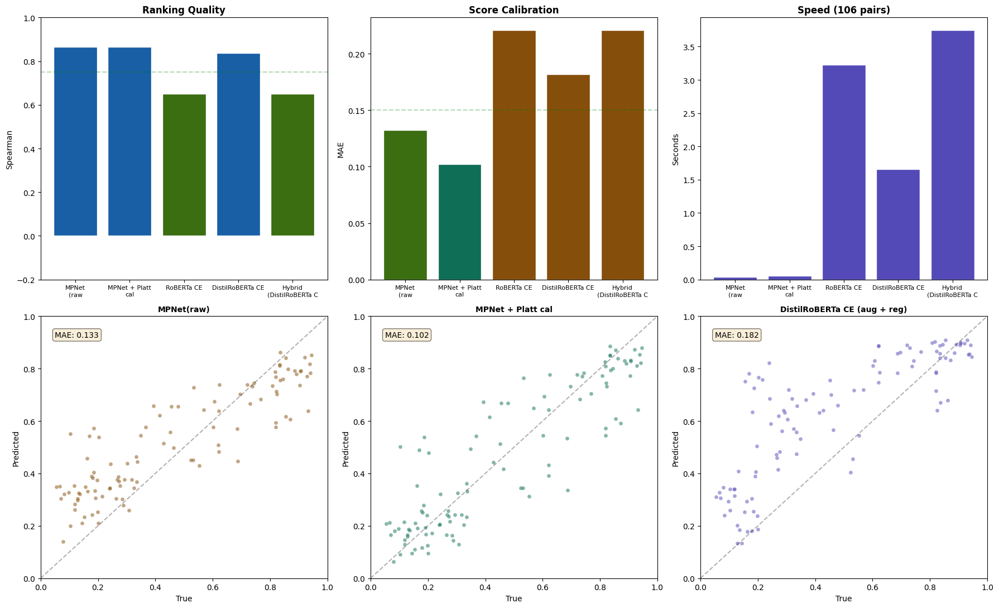

# ResumeAI — Resume ↔ Job Description Matching

Fine-tuned sentence-transformer system that scores how well a resume fits a job description
(0–1, calibrated), explains *why* via skill-gap analysis, and generalizes to job postings it
has never seen.

**Final model:** `all-mpnet-base-v2` fine-tuned with a combined ranking + calibration loss,
plus Platt score calibration — **Spearman 0.86, MAE 0.10 on 106 fully held-out pairs
from unseen job postings**, with 13 of 14 industries under 0.15 MAE. Platt is the
production calibrator (a 2-parameter sigmoid can't overfit a 106-pair calibration set);
isotonic regression scores identically within bootstrap noise.

**The app is a three-engine comparison harness.** The same resume/JD pair is scored by the
fine-tuned model, by Claude, and by a free open-weights model, side by side — because the
interesting question isn't "what does an LLM say", it's *whether a small purpose-built model
beats a general one, and how you'd know*. Only one of the three has an external-validation
number behind it, and the UI says which.

| | |
|---|---|
| 🎯 Live demo | *(Vercel — link coming)* |
| 📊 Full metrics | [`Results/results_summary.json`](Results/results_summary.json) |
| 📓 Research notebooks | [`Notebooks/`](Notebooks/) — six notebooks, in story order |
| 🔁 Reproduce | `python src/train.py` (details below) |
| 🧪 Tests | 104, all offline — no model downloads, no API calls |

---

## The story (why this project is interesting)

This isn't a "fine-tuned a model, got a number" project. The interesting part is what went
wrong in the middle and how the evidence changed the design.

### 1. Baseline fine-tuning (`Notebooks/01`)
Fine-tuned three bi-encoders (MiniLM, MPNet, BGE) on 500 curated resume–JD pairs with
CoSENTLoss. Stratified 80/10/10 splits, baselines measured before training, per-match-type
error analysis. Fine-tuning roughly doubled ranking quality over the base models.

### 2. Architecture study (`Notebooks/02`)
Compared classic bi-encoder (MPNet), instruction-aware bi-encoder (E5), a RoBERTa
cross-encoder, and a two-stage hybrid. Found the **calibration gap**: CoSENT-trained
bi-encoders rank well but compress every score into ~0.5–0.9 (cosine floor). Isotonic
regression fixed most of it without retraining.

### 3. External validation exposes the fraud (`Notebooks/03`)
Built a 212-pair external test set from 53 job postings the models had *never seen*, plus
smart JD preprocessing (strip EEO/benefits boilerplate, prioritize requirements sections).
Result: the cross-encoder that looked like the winner — **0.89 Spearman internally —
collapsed to −0.61 Spearman externally.** It had memorized the 200 training JDs
(125M parameters ÷ 400 training pairs ≈ 312k parameters per example). The humble
bi-encoder + calibration held up at 0.76 external. **Internal test sets lie; external
validation is the only number that matters.**

### 4. Systematic fixes — and an honest negative result (`Notebooks/04`)
Ablated four overfitting fixes on the cross-encoder: 3× data augmentation (section
shuffling, sentence dropping, keyword noise), weight decay, a smaller DistilRoBERTa, and a
5-fold ensemble. Every fix helped (−0.35 → +0.51 external Spearman) — **and none of them
beat the simple calibrated bi-encoder (0.77).** At this data scale, architecture capacity
is a liability, not an asset.

### 5. Production v2 (`Notebooks/05`) → Production v3 (`Notebooks/06`, current)
Acted on the evidence instead of the leaderboard instinct:
- **62 % more unique JDs** (815 pairs / 305 postings) — data beats architecture.
- **Combined loss** (CoSENT + CosineSimilarity): gradient signal for ranking *and* absolute score.
- **Calibration fitted on external data**: the 212 external pairs split 106/106 — isotonic &
  Platt calibrators fitted on the first half, final numbers reported only on the untouched second half.

**Final external results (106 unseen pairs):**

| Model | Spearman ↑ | MAE ↓ |
|---|---|---|
| **MPNet + Platt calibration (production)** | **0.8645** | **0.1021** |
| MPNet + isotonic calibration | 0.8667 | 0.1005 |
| MPNet raw (combined loss) | 0.8645 | 0.1325 |
| DistilRoBERTa cross-encoder (aug + reg) | 0.8379 | 0.1816 |
| RoBERTa cross-encoder (aug + reg) | 0.6514 | 0.2209 |

The two calibrators are statistically tied — the 0.002 MAE gap is well inside
run-to-run training noise and the bootstrap confidence interval on a 106-pair test
set. Platt ships because its 2-parameter sigmoid cannot overfit a small calibration
split, while isotonic's step function can (it fits the calibration set noticeably
tighter than it generalizes). Notebook 06 quantifies the tie with a bootstrap.

Batch ranking: 106 resumes scored against one JD in ~1.1 s (T4).

Production v3 (`Notebooks/06`) hardens this result: multi-seed training with
mean ± std reporting, a base-model baseline on the same held-out test, a bootstrap
comparison proving the Platt/isotonic tie, and a recruiter-facing top-candidate
ranking metric — plus HF Hub publishing so the live demo serves the real model.



---

## Architecture

Three engines score the same resume/JD pair, and the app is explicit about which one has
evidence behind it. The fine-tuned model is ~420 MB of PyTorch — far past a Vercel
serverless function — so it lives in its own service and Next.js calls it over HTTP.

```
  Browser ── Next.js (Vercel) ──┬── lib/providers/claude.ts      → Anthropic Messages API
                                ├── lib/providers/openrouter.ts  → free open-weights model
                                └── lib/providers/finetuned.ts   → FastAPI service (HF Space)
                                                                      │
                                     Supabase (Postgres)              └─ fine-tuned MPNet
                                     shareable results                   + Platt calibrator
                                                                         reusing src/ + app/
```

The three are **not** interchangeable, and the UI says so rather than pretending: the
fine-tuned model is an embedding scorer — it produces a calibrated score and a
requirement-by-requirement gap, but it cannot write prose. Each provider declares its
capabilities and the UI renders only what that engine can actually do.

## Repository map

```
Notebooks/           Research notebooks 01–06, in story order
Data/                Training + external test CSVs
Results/             Extracted charts + results_summary.json
models/              platt_calibrator.pkl (production calibrator; weights on HF Hub)
src/                 text_utils, augment, train — the model pipeline
app/explain.py       Skill-gap analysis (shared by the scoring service)
service/             FastAPI scoring service — serves the fine-tuned model over HTTP
web/                 Next.js 16 app (App Router, TypeScript, Tailwind 4)
supabase/schema.sql  Table + row-level security for shareable results
tests/, service/     Offline pytest suites
web/**/*.test.ts     Offline vitest suites
```

## Dataset provenance (honest version)

Job descriptions come from ~1,150 real LinkedIn postings (scraped, then curated to 305
unique JDs across 14 industries and multiple seniority levels). Resume texts and match
scores were **synthetically generated and hand-curated** against those real JDs, with five
labeled match types (`strong`, `good`, `partial`, `hard_negative`, `weak`) — hard negatives
are keyword-dense but wrong-role pairs (e.g., QA-automation Python vs backend Python).
The external test set (212 pairs, 53 JDs) has zero JD overlap with training and includes
deliberately hard edge cases: career changers, overqualified candidates, keyword-stuffed
mismatches. Synthetic labels are the main limitation — scores reflect the labeling rubric,
not recruiter ground truth. That's on the roadmap.

## Reproducing the model

The fine-tuned weights are not stored in this repo (they're ~420 MB). Regenerate them:

```bash
pip install -r requirements.txt
python src/train.py                       # full pipeline: train + calibrate + evaluate
python src/train.py --push-to-hub USER/resume-jd-matcher-mpnet   # optionally publish
```

- **GPU (recommended):** ~1 h on a free Colab T4 — open a notebook, clone the repo, run the same command.
- **CPU:** works, but plan for an overnight run.

`train.py` prints the final external-test table and writes `models/` (model + calibrators)
plus `Results/training_metrics.json`.

## Running it locally

Two processes: the scoring service (Python) and the web app (Next.js).

```bash
# 1. Scoring service — serves the fine-tuned model
pip install -r service/requirements.txt
uvicorn service.main:app --reload --port 8000

# 2. Web app
cd web
npm install
cp .env.example .env.local     # fill in the keys you want; see below
npm run dev                    # http://localhost:3000
```

**You only need the keys for the engines you want to use.** Each is read lazily, so the
app runs fine with just one configured — selecting an unconfigured engine returns a
`CONFIG_ERROR` naming exactly which variable to set, instead of the whole app refusing to
boot.

| Variable | For |
|---|---|
| `ANTHROPIC_API_KEY` | Claude engine. `ANTHROPIC_MODEL` defaults to `claude-opus-4-8`; set `claude-sonnet-5` for ~3× cheaper inference |
| `OPENROUTER_API_KEY` + `OPENROUTER_MODEL` | Free open-weights engine. **No default model** — free slugs rotate and get retired, so pick a current one from [openrouter.ai/models?q=free](https://openrouter.ai/models?q=free) |
| `SCORING_SERVICE_URL` | The Python service (`http://localhost:8000` locally) |
| `SUPABASE_URL` + `SUPABASE_SERVICE_ROLE_KEY` | Optional. Without them the app still analyzes — it just can't offer shareable links |

## Running the tests

```bash
pytest                # 61 tests — src/, app/, and the scoring service
cd web && npm test    # 43 tests — providers, API routes, persistence
```

**Every one of these is offline.** No test downloads a model, calls the Anthropic or
OpenRouter API, or touches a database — the sentence-transformer is replaced by a stub
encoder with hand-chosen vectors, and the LLM providers by a stubbed transport. That
means assertions about similarity bands (`covered` / `partial` / `missing`), calibration,
and JSON repair are exact rather than dependent on a live model's mood, and the suite
costs nothing to run.

The tests that matter most are the ones guarding invariants that would fail *silently*:

- the fine-tuned calibrator is **never** applied to base MPNet (it maps the fine-tuned
  model's cosine distribution; on base MPNet it would produce confident nonsense)
- inputs get the same 350-word preprocessing the model was **trained** under
- stored analyses are **private by default**, and a shared-link read only ever returns
  rows that were explicitly shared
- one engine failing in comparison mode never blanks out the others

Each of those was mutation-tested: the bug was injected, the suite was confirmed to catch
it, and the source restored.

## Deploying

| Piece | Where | Notes |
|---|---|---|
| Web app | Vercel | Set the project root to `web/`. Add the env vars above. |
| Scoring service | HuggingFace Space (Docker SDK) | The root `Dockerfile` builds it. Point `SCORING_SERVICE_URL` at the Space. Free Spaces sleep when idle — the first request pays a cold start, which the UI surfaces honestly rather than hanging on a spinner. |
| Database | Supabase | Run `supabase/schema.sql`. Row-level security is on; the service-role key stays server-side. |

## What I learned

- **External validation is non-negotiable.** A held-out split from the same JD pool still
  flattered the cross-encoder by 1.5 Spearman points (0.89 vs −0.61).
- **In low-data regimes, smaller + calibrated beats bigger + expressive.** Every
  anti-overfitting trick helped the cross-encoder; none closed the gap.
- **Calibration is a product feature.** Users see the score, not the ranking — a model
  that says "78 % match" for a 16 % match loses trust even when its ordering is right.

## Limitations & next steps

- Synthetic match labels → collect recruiter-labeled pairs for a gold test set
- PDF resume parsing in the app (currently paste-text)
- Score confidence intervals (fold-spread was a useful signal in the K-fold experiment)
- ONNX / quantized export for CPU-cheap serving

---

*David Lepighe · Apr–May 2026 (research), Jul 2026 (app) · [github.com/dlepighe1](https://github.com/dlepighe1)*
